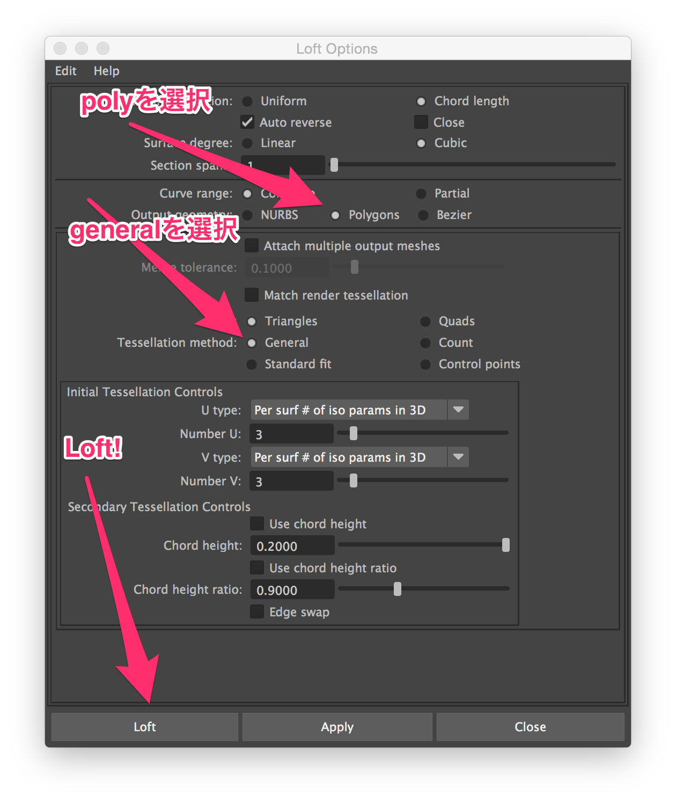

# Unity5 x Maya LT 2016 x Substance Painter
- [SDユニティちゃんで学ぶMAYA LT×Unity×SubstancePainterビギナーセミナー イベント用サイト]([http://www.borndigital.co.jp/seminar/3492.html])
- 場所：ボーンデジタル６Fセミナールーム
- 2015年3月29日（日曜）
- 14：00 – 18 :00

### DL素材
- [Unityちゃんデータ](https://www.dropbox.com/s/4m8zak1qc9wf2e2/BD_Seminar_SD_Unitychan.zip?dl=0)
- [その他のデータ](https://www.dropbox.com/s/xj88ul4w8wtyrhd/forSeminar.zip?dl=0)


## 次回のセミナー
- 次回 4月に後半にやる
- ２日限定の先行申し込みができる。
- 4/25日に開催予定

# maya から
- maya は 3 buttons mouse じゃないとあかんでー
- alt + b で背景の色を変えれる
- f キーでフォーカス
- alt + mouse_button(0) dragging でカメラ操作
- alt + mouse_button(1) dragging でドリー（カメラとの距離を変更）する。ズームではない。
- alt + mouse_button(2) dragging でカメラのパン二ングを行う。
- maya では マニピュレータと呼ぶ

## Move tool
- global axis は x : 赤, y : 緑, z : 青 と決まっている。画面左下に表示されている。
- D キーを押しながらEdgeやPointを選択すると先に選択済みの頂点に対して移動の方向を選択できる。
- null を選択してDキーをおすと取得した方向軸がリセットされる
	- これはあとでちゃんとまとめた方がいい

## Rotate tool, Scale tool
- 同様にマニピュレータを操作することで変更が可能
- マニピュレータの軸の間にある面ポリゴンをドラッグすることで２軸のみに絞って移動・回転・拡大縮小をすることができる。


## モデリングしてみる
- 保存時プロジェクトを作ってから保存する
	- File > Project Window
- Maya ProjectはUnityのようにSceneフォルダやら諸々のフォルダーが生成される。
- プロジェクトを作成することによって、シーンを保存するときは上記で作ったプロジェクト下のSceneディレクトリが保存時に自動的に選択されるようになる。
- プロジェクトの設定していない場合に最初にどこのディレクトリを開くかも、予め指定できる。

### レイヤーの概念
- ディスプレイレイヤー
	- 表示や選択を切り替えるphotoshopのレイヤー(というよりもフォルダ)のようなもの
	- 画面右下にDisplayのペインが存在している


- レイヤーは設定がこまかくできる


- サンプルオブジェクトのサイズがでかいのはUnityちゃん用


### grid
- Gridの間隔はユニットと呼ぶ。
	- ユニットは1cmの単位で刻まれている


- 通常のアプリケーション同様に Command + , でPreferenceを開くことができる。
- Gridのサイズを変更はPreference > settings > Working Units > Linear を変更する。


### サイズを測る
- 椅子の１辺のサイズを調べる
- Distance tool を使用する


- 画面を横からの状態に切り替えて位置を１点クリックすると距離が表示される


- window > outliner を選択するとwindowが出現
	- outlinerはHierarchyみたいなもの
- Ctrl + a で attribute editor と切り替えできる。blender の property ペインみたいなもの。

### 角棒の面取りを行う(Bevel)
- Edge選択モードにする
- 角棒を全て選択する
- Shift + mouse_button(1) 長押しから Bevel Edge が行われる
	- Shiftをおすことで現在選択中のオブジェクトに対してできModifierMenuのみが表示される。

### 分割
- Shift + mosue_button(1) 長押しで Insert Edge Loop Tool 選択。


- 4 キーで選択中のオブジェクトをワイヤー表示にできる。
- cntrl + mouse_button(1) で頂点の選択解除
- shift + mouse_button(0) で追加選択・非選択
- 選択した頂点をscaleで移動させる。このとき shift + mouse_button(1) dragging だと通常のドラッグ量を小さくしてくれる。
- 任意の場所ではなくて、指定したEdgeにたいして垂直に、指定の数分だけ分割するには左側に出現したペインから次のようにパラメータを指定する。


### 頂点法線
- Display > Polygons > Vertex Normal で法線を表示させる


これを選択すると


- Mesh display > soft edge
	- エッジをソフトにする。名前まま。


### 椅子のたわんだせもたれを作る
CVツールをつかって、線を描くように頂点を生成し、それをつなげ合わせてEdgeを生成する。
そのEdge同士を組み合わせて面を作る。


- CV ツール
	- クリックしたところに頂点を配置する
	- 最後にEnterをすることでポリゴン(edge)を作成する。


- Cntrl + d でduplicate し、新たにできた方と元の方をそれぞれ椅子の背もたれにあたる場所の両端に置く。
- 両方を選択したら、`Loft` で複数のカーブを接続


- つなげたポリゴンの分割具合を指定




ドラッグ量に応じて分割数が変化し、View側でもそれを確認できる。


分割する場所を均等にではなくて、指定のEdgeをベースに行う場合のパラメータ群


### UV
この時点でけっこう時間的に押していて、作業しながらではなくて観ることに徹する流れに。

- UV Editorを立ち上げる
	- Windows > UV Editor
	- 角棒に木目テクスチャを貼る
	- UVをの円柱モデルを角棒に合わせて変更し、その後、正規化してあげる
	- ポリゴンを選択するとUVEditor側にも選択が保持される。
	- カメラで見た状態のUVをそのまま展開させることができる。
	- UVEditor上で最適化、展開をすることで


## Substance painter
テクスチャをいい感じにUVマテリアル化するツール。
多数のプリセットマテリアルがあるので、新たにテクスチャを起こす手間がほとんどなくなるツール。

- F2 キーで3Dのみの表示
- F1 ~ F3 キーでメインのペインを3D/2D/3D+2Dの切り替えができる。
- C キーで１つずつのマッピング内容を確認することができる。
- Normalチャンネルは新規で作成したので表示されていない
	- 画面右側の[Material] 下の [nrm] をクリックするとnormalをonにすることができる。
- M キーで全部表示ができる

先に作成した椅子の各部位にマテリアルを割り当てる。

### 布のマテリアル
- マテリアル単位でレイヤーを持つ。
- 塗りつぶしレイヤーをこのマテリアルに追加する。


- height マップをきってnormalを追加
- normalはnrmでアクティブに。
- Materialsから fablic を選択する。
- あとは適当に。

### 木のマテリアル
- 上記と同じでmaterialをwood american cherryを選択する。

### 金属の部分
- materialをmetalを選択

### 環境の設定
- 先のmayaでおこなった面取りをちゃんとしておかないとエッジのツヤがきれいにでない。
- HDRマップでライトの表現を変更し、影の出力具合を変更できる。

### export
- File > Export All channelsでエクスポートウィンドウを表示
- configuration タブ を選択
- Unity 5 で選択したマテリアルと設定の内容を確認する
- bolt は Unity5 Standard Metalic
- それ以外は は Unity5 Standard Speculer
- でexportする


## Unity5
Referection proveが範囲ないの反射をおこない。

- mtearic と speculer gross ness という方式の２種類のPBR作成方法がある。
- Standard shader は metaric roughness になる。


### lighting
- light prove とか bake は全部lighting window に統一された
- Procedual で環境光の変更
- 物理ベースシェーディングなのであれば…
	- きちっとできたマテリアルは数値の設定をする必要がない。
	- emittion については反射量を１以上にすることができる。
- bitmap to material で写真からマテリアルを作ることができる

### rigging
すでにあるUnityちゃんモデルにたいして、人体用のアセットとの関連付けを行う。
人体アセット用ボーン構造にたいして、Unityちゃんにあてられたボーンのどの部位が該当するのかを割り当てる。

- PBRとはなにか？
	- Physical base Rendering の略。物理ベースレンダリング。
- PBR_SD_unitychan_humanoid を使う


- Assignしたrigを保存しておける


### 延長戦(MEL)
- window > CharacterSet
- 画面右下のボタンからにscript editorが出せる

``` MayaMel

character -name "CharacterSet1" -excludeVisibillity - excludeScale;

```

- Script Editor の保存を適当なシェルフをしたところで保存すると、シェルフにアイコンが追加されて保存がなされる。

```MayaMel

select -r -ne CharacterSet1 ;
setKeyframe -breakdown 0 -hierarchy none -controlPoints 0 -shape 0 {"CharacterSet1"};

```

- キーが打たれたタイムライン上で、中ボタンを押したままドラッグすると別のたいむらいにコピーされる。
- このままだとキー自体は打たれないので、そのままキーを打つ。今回のセミナーだとAlt+sにキーを打つmelを作成していたので、そのmel経由でキーを作成。

- FBX export で FBX にanimationをbakeして出力する。
- 踏み込みメディアなども不要になる

### Unityで読み込む
- Rig タブ
	- RigはGenericになっているのをHumanoidにしておく
	- 顎におかしなものがついていることがある。
- animation タブ
	- animation complession = off
	- animation 1~2フレームを pause1
	- 同様に3~4を pause2
	- ポーズの焼き付けはしておくべし。

- やはりキーは２フレーム以上じゃないとanimデータ化できないっぽい…(poi)
- 年末に作成した3Dのデータはアニメーション含めてMayaに移植しよう…

## 参考
- [BornDigital主催 Autodesk MayaLTセミナー資料 HumanIK×Mecanim使いこなしTips（キャラアニメ編）](http://www.slideshare.net/nyaakobayashi/bd-maya-ltcharaanime131128)
- [Mel scripting](http://download.autodesk.com/global/docs/maya2014/en_us/index.html)


-
-

